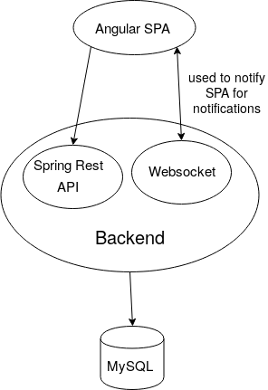

# Twoter REST API built with Java8 and Spring5

## Description

Part of a mini social network project combining features from Facebook and Twitter (post updates and comments, like updates and comments, register, login, follow other users, receive notification in realtime when your comment/update is liked, when someone you followed has posted an update).

## Features

- Auth: sign up, login, logout
- Update profile info, profile picture, etc.
- Follow other users
- Post updates. Updates may contain tags.
- Search updates by tags
- Comment updates
- Like posts and updates
- Receive realtime notifications for someone commenting on your updates, liking your updates or comments, someone you follow posts something.

## Purpose

This project main purpose is for skill sharpenning

## NOTE

As I mentioned previously the purpose of this project is to sharpen my skills and the project lacks tests and comments on some places which should normally not be omitted

docker run -d -p 3307:3306 -e MYSQL_ROOT_PASSWORD=root -t mysql:5.7
mysql -u root -p -h 0.0.0.0 -P 3307 -D social < ./sql/init_db.sql
